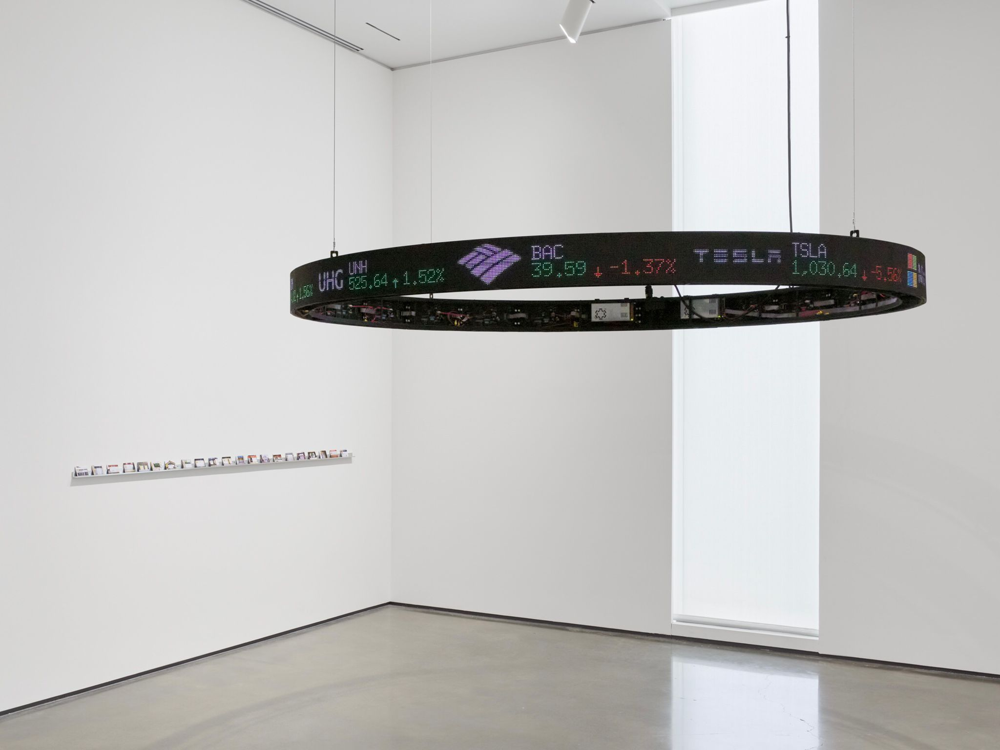

# Bloko's ticker scroller display

- This software was developed for my friend Ignacio Gatica's art project called "Stones Above Diamonds"
- It's job is to control an LED display, similar to the ones seen on financial districts. Here is a picture of it in action at [Hessel Museum of Art](https://ccs.bard.edu/museum):

### Install
- This software is meant to run on a Raspberry Pi running Raspberry Pi OS. Tested on Raspberry Pi OS Lite Kernel version: 5.10, Debian version: 11 (bullseye)
- Requires Python version 3.7 at least, tested on 3.9
- Requires internet connection in order to update ticker values
- For the ticker display: 
  - You must first install this: https://github.com/hzeller/rpi-rgb-led-matrix
  - Make sure Python 3 bindings are correctly installed by running some samples 
  - Then clone this repo inside `bindings/python/samples` folder
  - Only then you should try to run the ticker

## Autostart setup

- Run `./install-services.sh`
- Make sure its executable `chmod +x install-services.sh`

### Handy commands

- Run scroller only: `$ ./run_scroller.sh`
- Check service status: `$ systemctl status bloko.service`
- Restart service `$ sudo systemctl restart bloko.service`
